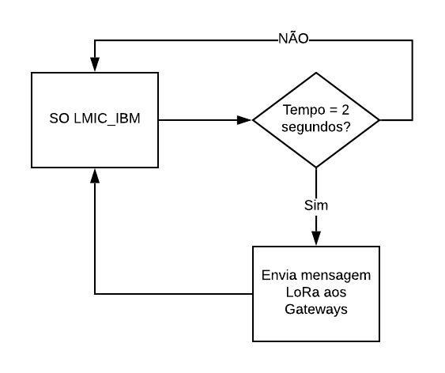
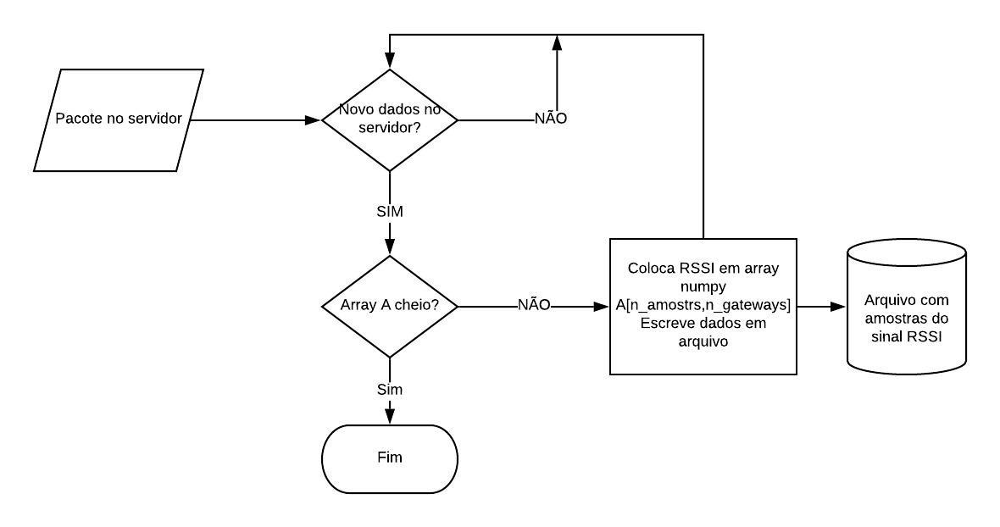
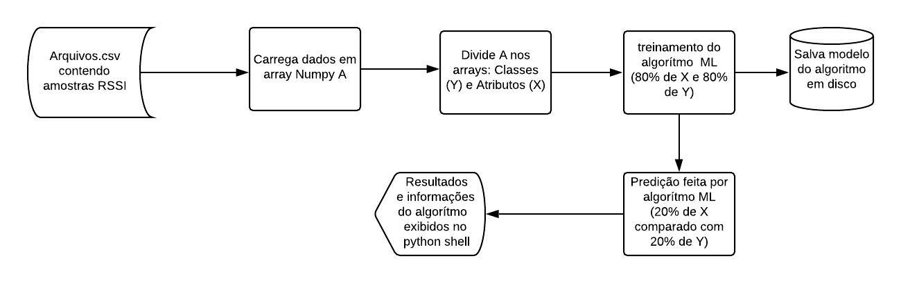
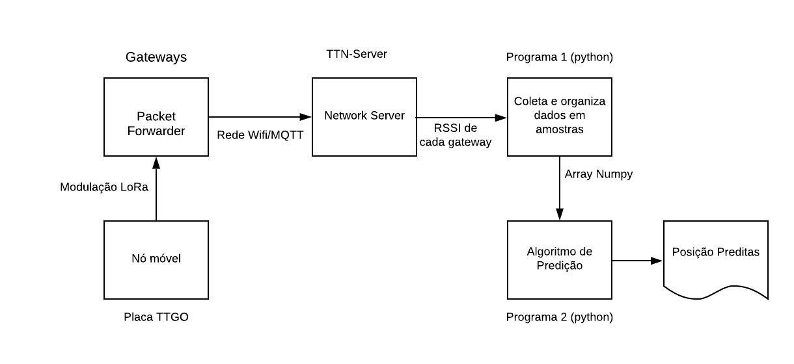

# IPS (Indoor Position System)-com-LoRa-WAN

## Repositório do TCC : SISTEMA DE LOCALIZAÇÃO EM AMBIENTES FECHADOS UTILIZANDO LORA WAN

### Resumo
 O presente trabalho mostra um estudo com caráter de pesquisa tecnológica, relacionado ao uso da tecnologia LoRa pra geolocalização indoor, bem como, métodos comumente utilizados em tecnologias de rede sem fio para a obtenção de geolocalização. Serão abordados conceitos a respeito do protocolo LoRaWAN e dois algoritmos de aprendizagem de máquina. Em seguida será implementada uma rede LoraWAN e feitos experimentos, para verificar o comportamento da intensidade do sinal irradiado pelos nós da rede em relação a distância entre eles, analisando assim, a ideia de utilizar os algoritmos e a intensidade do sinal para tentar fazer predições a cerca da localização de um dos nós da rede.
 
### Desenvolvimento
  #### **End node ou nó móvel:** placa ESP32, envia para rede mensagens periódicas com o objetivo de se medir a intensidade do sinal do nó no espaço. Rotinas implementadas sobre o SO LMIC da IBM. 
  
  #### **Gateways:** Placas raspberry PI com módulo LoRa. Recebem a mensagem do end node e a encaminha para a aplicação via TTN Server, utilizando github de implementação de gateway LoRa monocanal: https://github.com/tftelkamp/single_chan_pkt_fwd.
  
  #### **Aplicação (App_python):** Cliente MQTT rodando em máquina local. Se divide em dois programas em python; 
  ###### Programa um: aquisição dos dados recebidos pelo TTN Server 
  
  ###### Programa dois: Treinamento de modelos de Machine Learning utilizando intensidade do sinal do end node e predição de sua posição geográfica num espaço indoor. 
  
### Fluxo dos dados no sistema IPS
  Visão geral (top view) do funcionamento do sistema para a realização dos experimentos.
  
  
  Mais detalhes sobre o Trabalho: [SISTEMA DE LOCALIZAÇÃO EM AMBIENTES FECHADOS UTILIZANDO LORA WAN](https://github.com/TarsisNatan/IPS-com-LoRa-WAN/blob/master/TCC_final%20Corrigido.pdf/)
